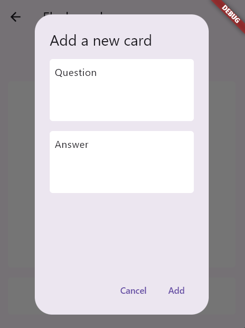

# Even Flashcards

This is an idea prototype for **Even Flashcards**, the next-generation memory learning app designed for Even Realities G1 glasses! 🚀

Imagine a world where learning is immersive, interactive, and right before your eyes. With Even Flashcards, you can experience flashcard-based memory learning in augmented reality, making studying more engaging and effective than ever before. Whether you're a student, a professional, or just someone looking to expand your knowledge, Even Flashcards is here to revolutionize the way you learn.

## Current Demo Prototype

After connecting your glasses, navigate to the Features page and then the "Flashcard" page. Click to add several flashcards of what you want to learn (e.g., write a word in your native language on the front page, and its translation to the language you are learning on the back page). After that, click on "Review Cards on Glasses". This should display each card that is to be reviewed as text on the glasses; it will first display the front page, then the back page, and then wait for your voice command to rate how difficult it was for you. You can say one of the following options:

1. "again": it will schedule the card for an immediate review;
2. "hard": it will schedule the card for a short-term review (e.g., in a few minutes);
3. "good": it will schedule the card for a mid-term review (e.g., in a few hours);
4. "easy": it will schedule the card for a long-term review (e.g., in a few days).

The interval for the card reviews increases over time depending on the previous ratings. The scheduling is done using the [FSRS (Free Spaced Repetition Scheduler) algorithm](https://github.com/open-spaced-repetition/fsrs4anki/wiki/The-Algorithm): "newly introduced and more difficult flashcards are shown more frequently, while older and less difficult flashcards are shown less frequently in order to exploit the psychological spacing effect" ([see the Wikipedia page for more details](https://en.wikipedia.org/wiki/Spaced_repetition)).

## Potential Future Improvements

The current prototype is very limited to demonstrate the concept. The idea could be enhanced in the following ways:

1. Completing the basic flashcard functionality: persistent storage of flashcards, card management (grouping cards into decks), etc.
2. Non-textual card content (sound and grayscale images, e.g., diagrams).
3. Option to reveal the back page using a voice command.
4. Auto-rating using voice recognition: e.g., the back page won't be revealed until the user says the answer; and they will have 3 attempts for the correct answer. Depending on how many attempts it took for the answer, the system will automatically rate the card feedback for scheduling the next review.
5. Connecting the learned flashcard with the translation feature: this can be on top of the idea Mentra has for language learning where glasses should display the "unknown" words to the language learner:

